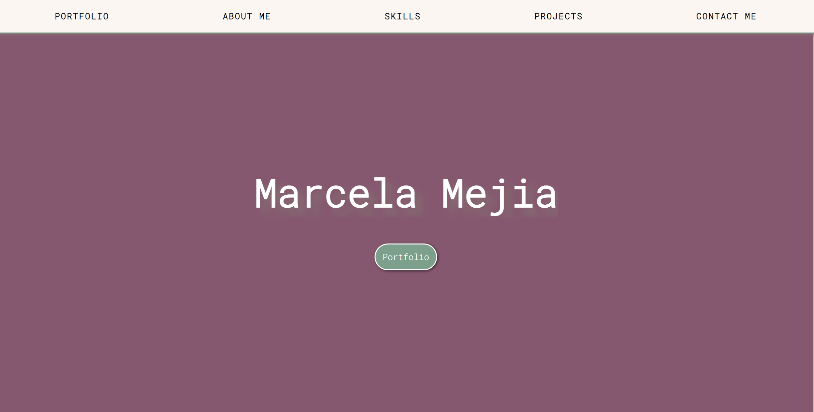

# **Portfolio-SCSS**

## **Table of Contents** 

  - [**Table of Contents**](#table-of-contents)
  - [**Description**](#description)
    - [**User Story:**](#user-story)
  - [**Technologies Used**](#technologies-used)
  - [**Preview**](#preview)
  - [**Deployed link**](#deployed-link)
  - [**Future Development**](#future-development)
  - [**Questions**](#questions)

## **Description**
This is my professional portfolio created using HTML, CSS and Sass/Scss.
This project is about building my own portfolio of work with the purpose of showcasing my skills and talents to employers. 

For this project I decided to choose my favourite colours, to make it more personal. [Colour palette here](https://colorhunt.co/palette/867070d5b4b4e4d0d0f5ebeb)

### **User Story:**
  AS A Web Developer,

  I WANT to create my professional Portfolio implementing the technologies I know,

  SO THAT I can effectively show the projects that I worked on and recruiters can contact me.

## **Technologies Used**

* HTML
* Sass/Scss
* CSS

## **Preview**
 

## **Deployed link**

💡 Live version: [click here!](https://marcelamejiao.github.io/Portfolio-Scss/) 

## **Future Development**

* Include future projects. 
* Update my portfolio with new features using JavaScript.

## **Questions**

* Contact me on my GitHub profile: [Marcela's GitHub](https://github.com/marcelamejiao)

